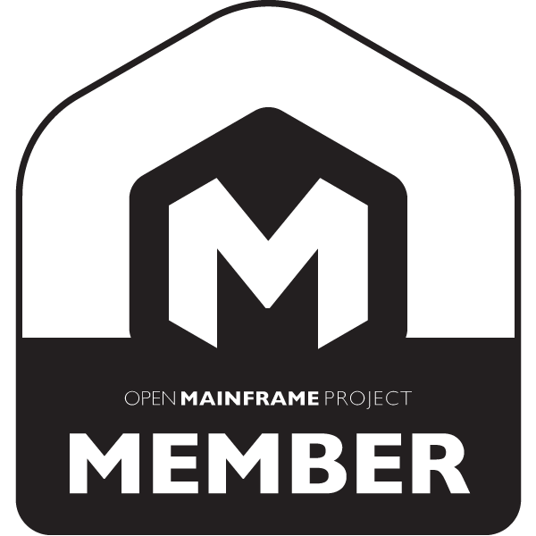
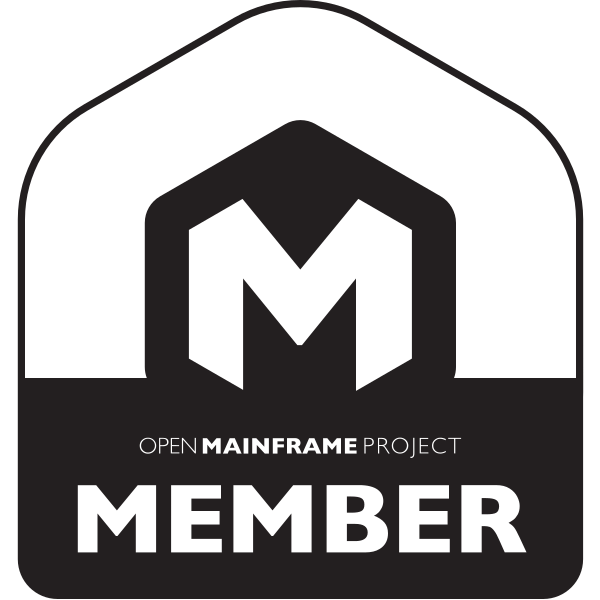
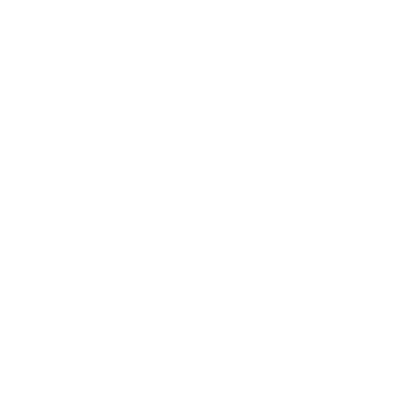
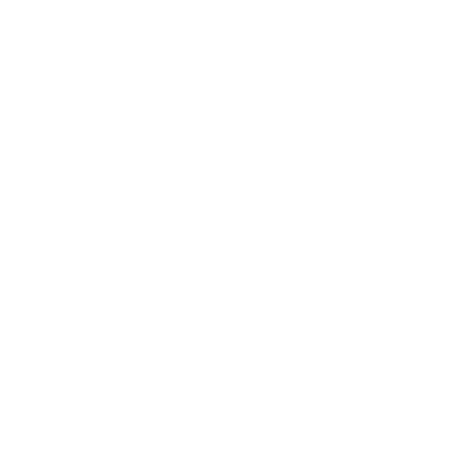

# Open Mainframe Project Member Logos

*Note: GitHub Flavored Markdown used in the Readme doesn't support background colors. The white logos below are displayed on the light grey of tables.*

<table class="logos-table">
    <tr>
        <th></th>
        <th>PNG</th>
        <th>SVG</th>
    </tr>
    <tr>
        <th>color</th>
        <td></td>
        <td></td>
    </tr>
    <tr>
        <th>black</th>
        <td></td>
        <td></td>
    </tr>
    <tr>
        <th>white</th>
        <td></td>
        <td></td>
    </tr>
</table>

