# Zowe Conformant Support Provider Logos

The Zowe Conformant Support Provider marks are only available for use with <a href="https://www.openmainframeproject.org/projects/zowe/support-conformance" style="color:black !important;text-decoration:underline !important">Zowe Conformant</a> implementations and must comply with the <a href="https://www.openmainframeproject.org/projects/zowe/conformance/branding-guide" style="color:black !important;text-decoration:underline !important">Zowe Conformant Brand Guidelines</a>.

*Note: GitHub Flavored Markdown used in the Readme doesn't support background colors. The white logos below are displayed on the light grey of tables.*

## Zowe Conformant Support Provider Comprehensive ZOWE V1

<table class="logos-table">
    <tr>
        <th></th>
        <th>PNG</th>
        <th>SVG</th>
    </tr>
    <tr>
        <th>color</th>
        <td>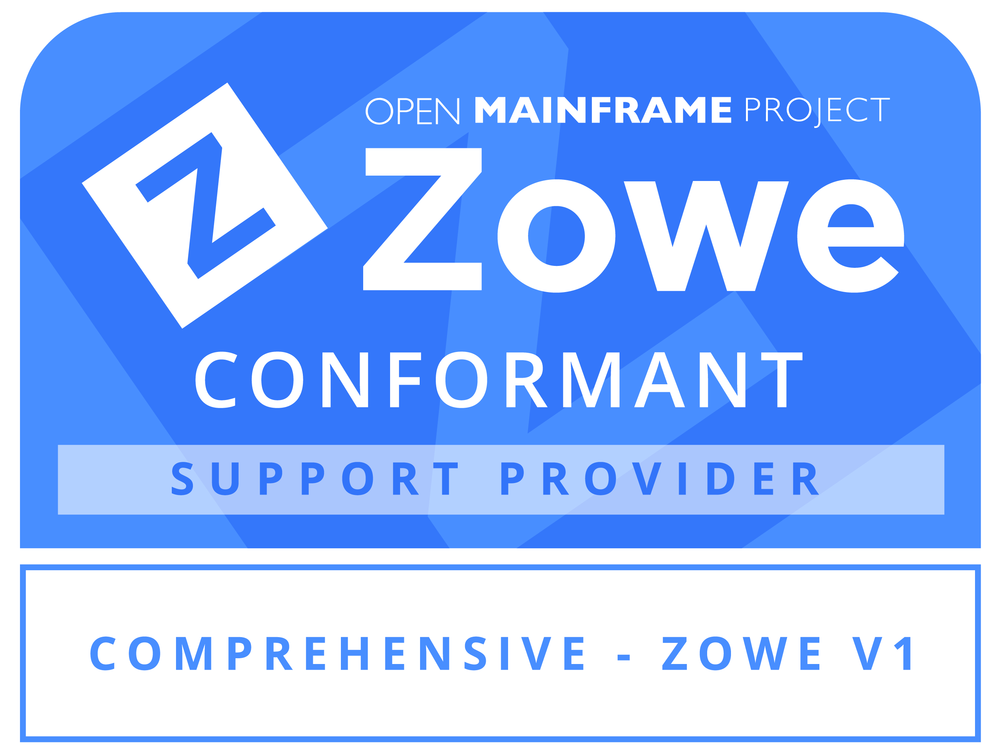</td>
        <td>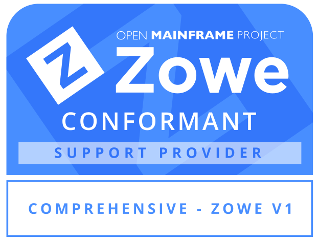</td>
    </tr>
    <tr>
        <th>black</th>
        <td>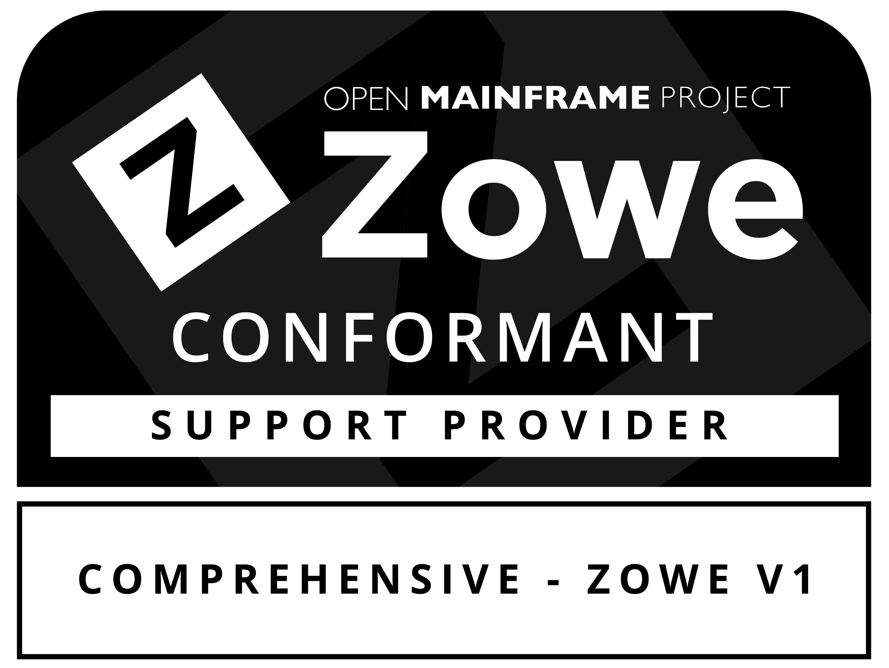</td>
        <td></td>
    </tr>
    <tr>
        <th>white</th>
        <td></td>
        <td>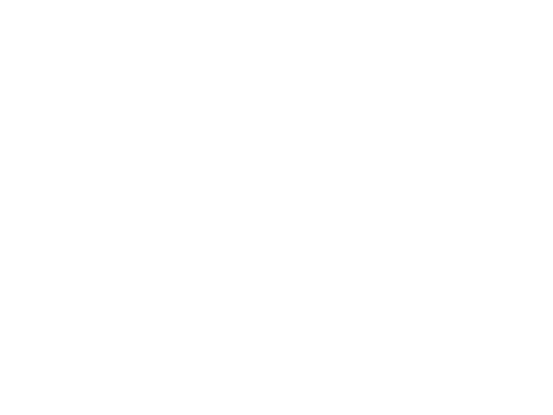</td>
    </tr>
</table>

### API Mediation Layer ZOWE V1

<table class="logos-table">
    <tr>
        <th></th>
        <th>PNG</th>
        <th>SVG</th>
    </tr>
    <tr>
        <th>color</th>
        <td>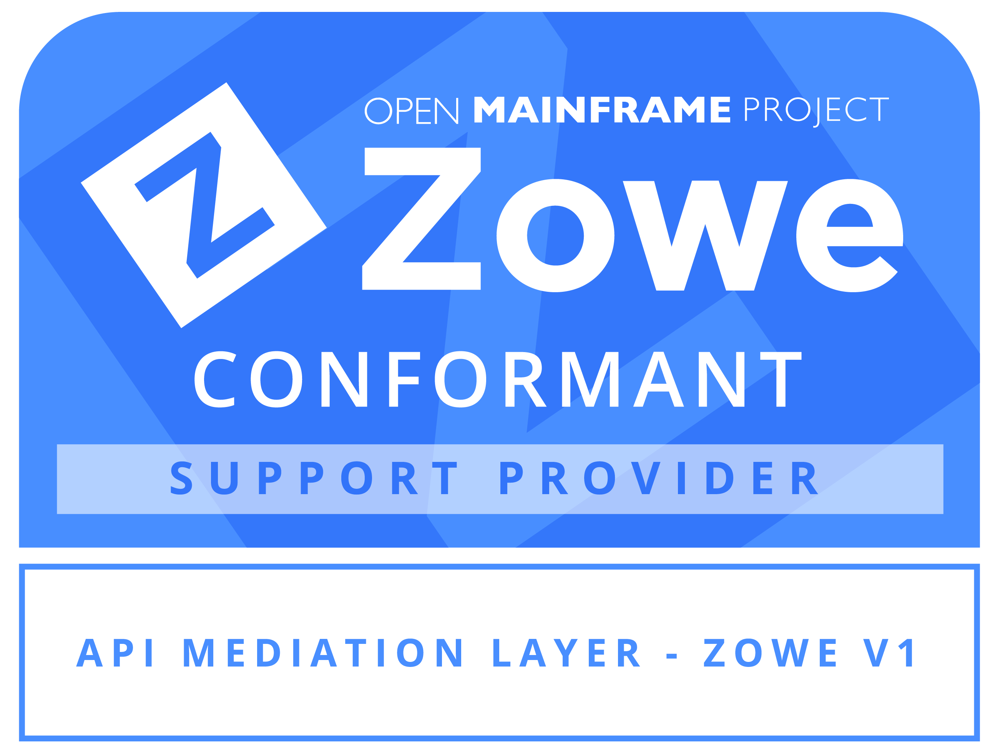</td>
        <td>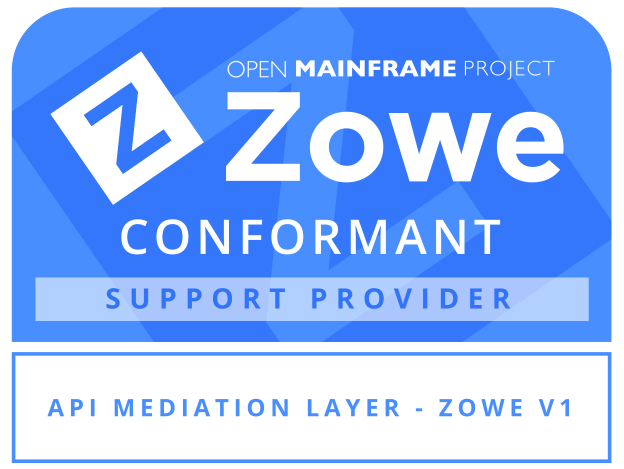</td>
    </tr>
    <tr>
        <th>black</th>
        <td>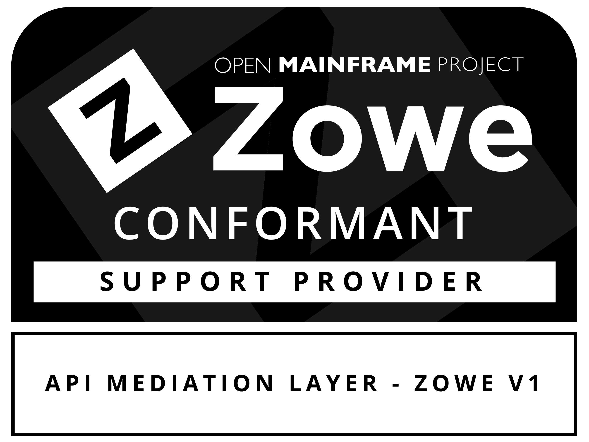</td>
        <td></td>
    </tr>
    <tr>
        <th>white</th>
        <td></td>
        <td>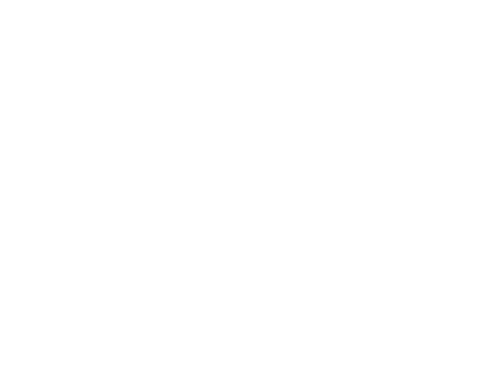</td>
    </tr>
</table>

### App Framework ZOWE V1

<table class="logos-table">
    <tr>
        <th></th>
        <th>PNG</th>
        <th>SVG</th>
    </tr>
    <tr>
        <th>color</th>
        <td>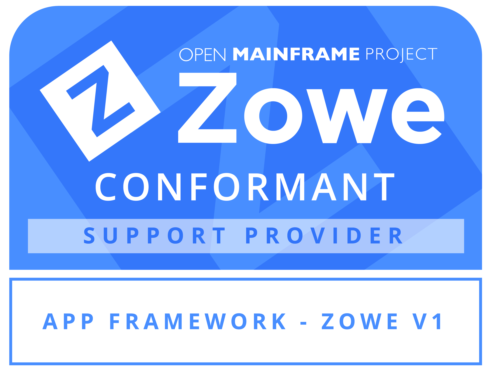</td>
        <td>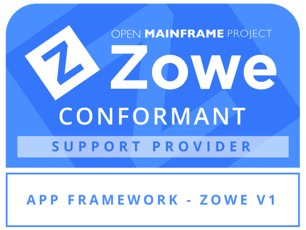</td>
    </tr>
    <tr>
        <th>black</th>
        <td>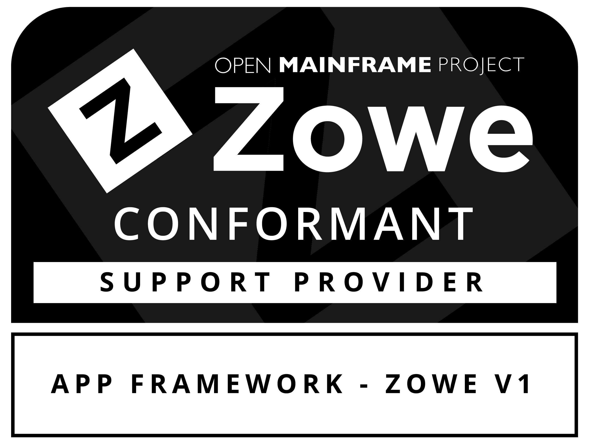</td>
        <td>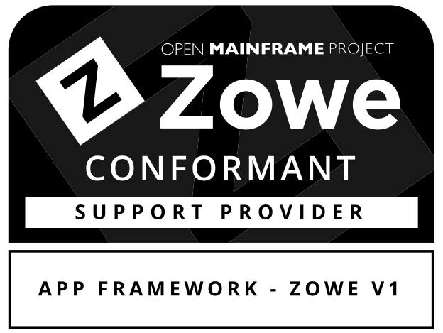</td>
    </tr>
    <tr>
        <th>white</th>
        <td></td>
        <td></td>
    </tr>
</table>

### CLI ZOWE V1

<table class="logos-table">
    <tr>
        <th></th>
        <th>PNG</th>
        <th>SVG</th>
    </tr>
    <tr>
        <th>color</th>
        <td>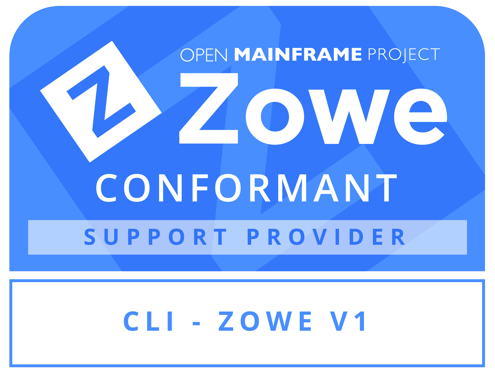</td>
        <td>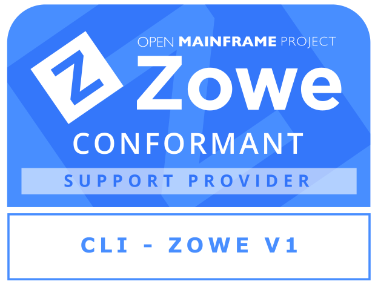</td>
    </tr>
    <tr>
        <th>black</th>
        <td>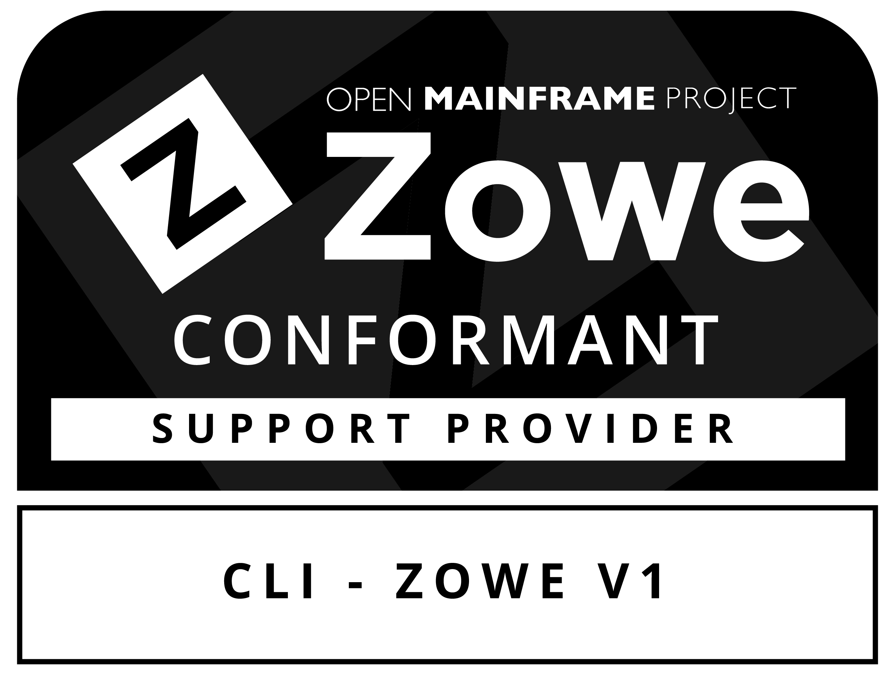</td>
        <td></td>
    </tr>
    <tr>
        <th>white</th>
        <td></td>
        <td></td>
    </tr>
</table>
 

### Explorer for VS Code ZOWE V1

<table class="logos-table">
    <tr>
        <th></th>
        <th>PNG</th>
        <th>SVG</th>
    </tr>
    <tr>
        <th>color</th>
        <td></td>
        <td></td>
    </tr>
    <tr>
        <th>black</th>
        <td>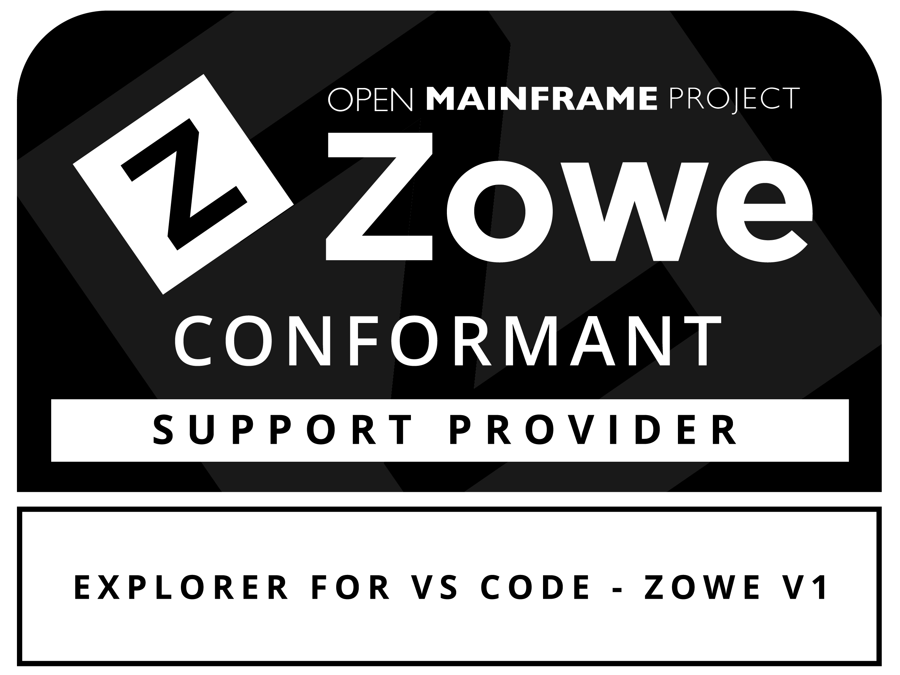</td>
        <td></td>
    </tr>
    <tr>
        <th>white</th>
        <td></td>
        <td>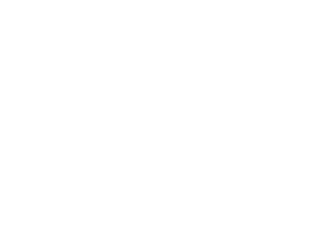</td>
    </tr>
</table>
 
